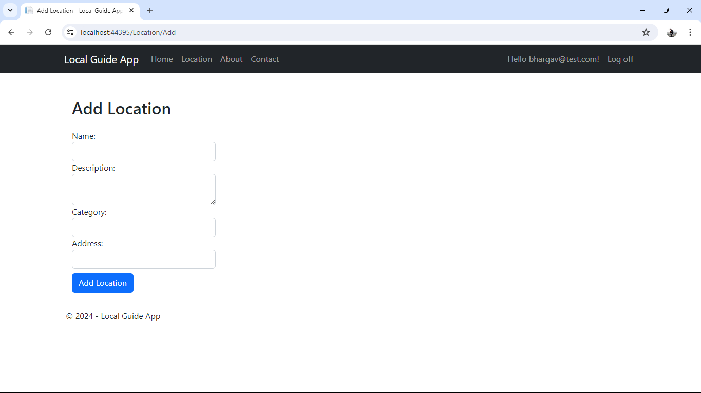
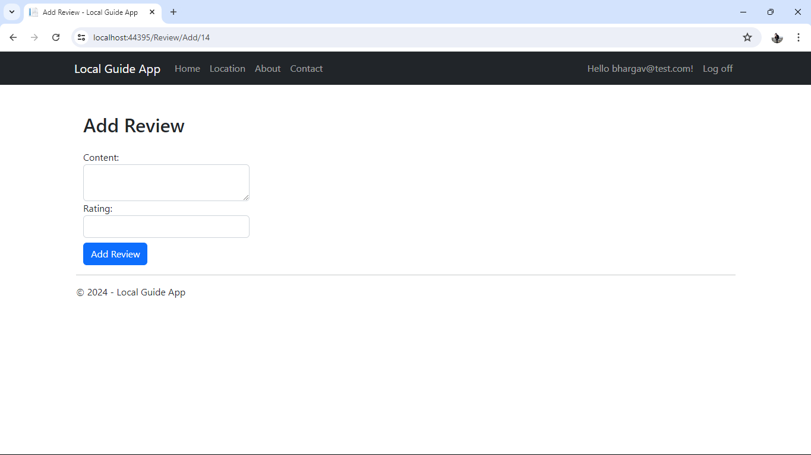
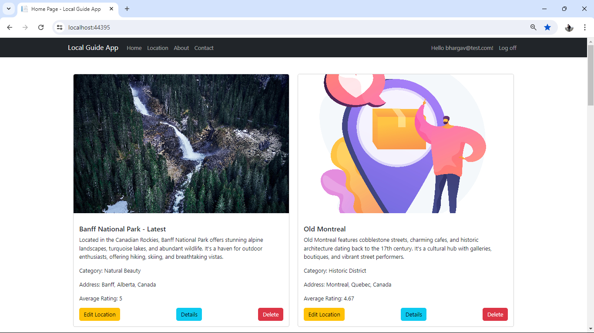
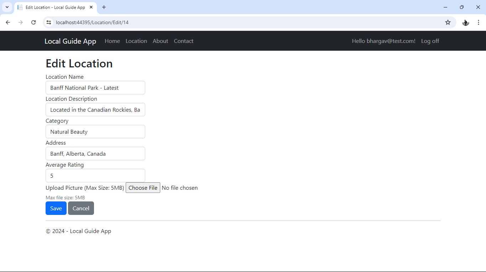
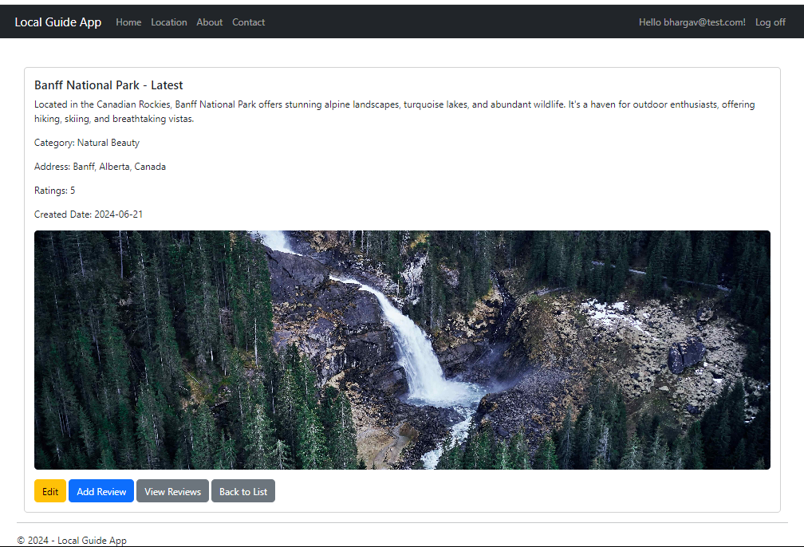
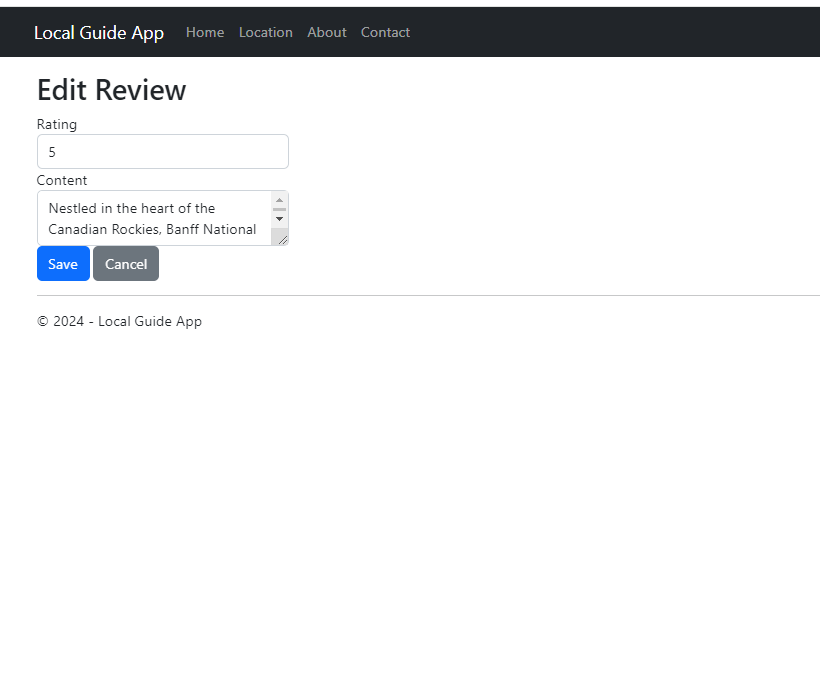
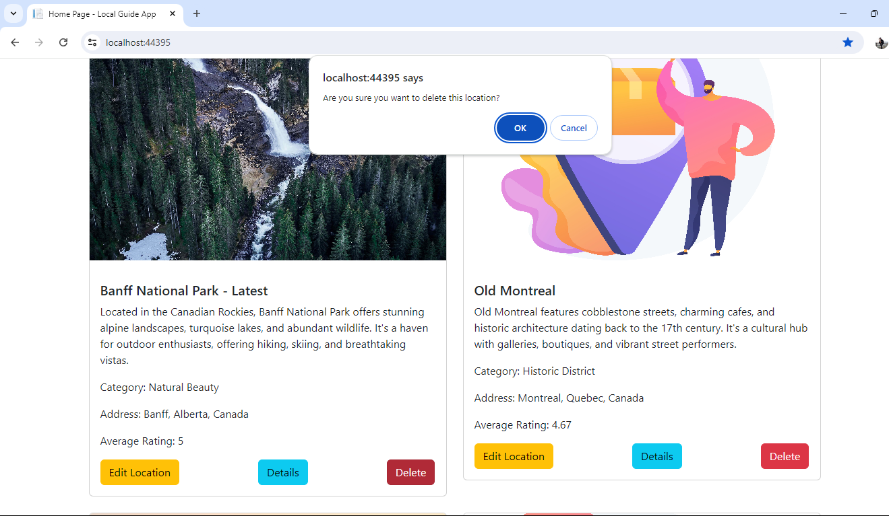
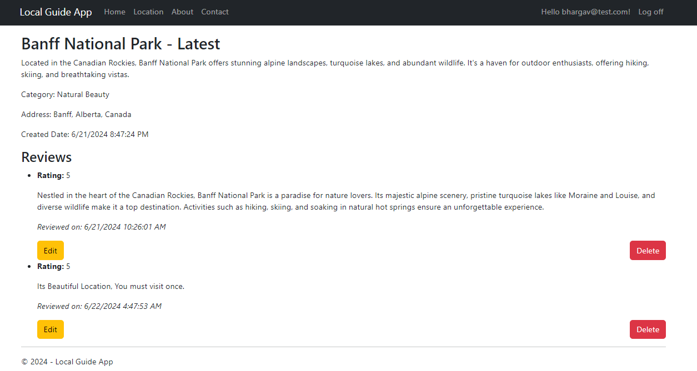

# Local Guide App

A CMS for local guides to share information about attractions, restaurants, events, and services in their area.

## Inspiration

Inspired by my passion for being a Google Local Guide and sharing reviews and photos of various locations, I aim to develop a Local Guide web app. This app will serve as a platform for users to discover and explore local attractions, restaurants, events, and services through the eyes of fellow community members. Users can contribute by adding new locations, writing reviews, uploading photos, and sharing their experiences. The app will emphasize community engagement and collaboration, empowering users to make informed decisions about where to go and what to do based on authentic, user-generated content.

## Features

- Form for user authentication.
- Location management for adding and updating local spots (attractions, restaurants, etc.).
- Review and rating system for locations.
- Search functionality to find locations by category or keyword.

## Storyboard

### Scenario: A resident logs in and visits a new restaurant

1. **User Authentication**
   - The user logs into the Local Guide app.
   

2. **Adding a Location**
   - The user navigates to the "Add Location" page, enters the restaurant details, and saves it.
   

3. **Leaving a Review**
   - After liking the restaurant dishes, the user leaves a review and rating.
   

### Scenario: Restaurant/Store Owner

1. **Listing a Location**
   - Maria, a restaurant owner, lists her newly opened bistro on the Local Guide app.
   

2. **Benefits to Owner**
   - Maria sees a surge in reservations and walk-in traffic as the app exposes her bistro to a wider audience.
   

## Screenshots

### Location Management

- **Edit Location**
  - Edit existing location details.
  

- **Location Details**
  - View detailed information about a specific location.
  

- **Viewing Locations**
  - Overview of all listed locations.
  

### Reviews and Ratings

- **Adding a Review**
  - Leave a review for a specific location.
  

- **Editing a Review**
  - Edit or update a previously submitted review.
  

### Confirmations

- **Delete Confirmation**
  - Confirmation prompt before deleting a location.
  

### Additional Features

- **Location with Reviews**
  - View a location along with its reviews and ratings.
  

---

Feel free to adjust the text or image paths according to your actual file structure. This README.md provides a clear visual guide to the Local Guide App's features and functionalities, making it easier for users and stakeholders to understand and navigate the application.